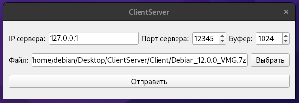
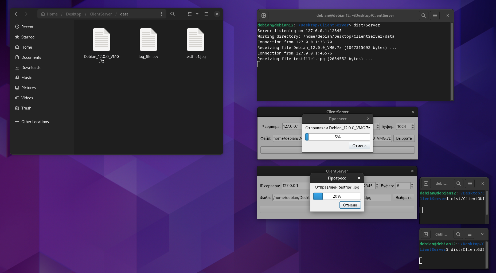

# ClientServerFileTransfer
### Задание:
Разработать клиент-серверное приложение для ОС Debian 12, реализующее передачу выбранных клиентом файлов на сервер и сохранение переданных файлов сервером.
### Общие требования:
1) Клиентская и cерверная части приложения должны быть разработаны с использованием языка Python версии 3.7+
2) Исходники должны быть выложены на github.com с публичным доступом
3) Сетевое подключение между клиентом и сервером должно быть реализовано с использованием библиотеки socket
### Требования к клиентской части:
1) Клиент должен иметь возможность передать файл на Сервер. Указать файл для передачи и Сервер, на который следует передать файл, Клиент должен при помощи консольного интерфейса, например, при помощи флагов;
### Требования к серверной части:
1) Сервер должен иметь возможность сохранять переданные Клиентом файлы, директория для сохранения должна задаваться при помощи консольного интерфейса при запуске Сервера;
2) Сервер должен должен хранить атрибуты файлов: имя и время добавления файла.
---
### Задания:
- [x] Этап 1:
    - Реализовать требования к клиент-серверной части приложения.
    - Реализовать упаковку клиентской и серверной частей приложения в виде бинарных файлов.
- [ ] Этап 2:
    - Реализовать графический интерфейс для Клиента. При помощи графического интерфейса Клиент должен иметь возможность выбрать для передачи Серверу произвольный файл. Консольный интерфейс должен быть сохранен. Рекомендуемая библиотека для реализации графического интерфейса - PyQT.
### Дополнительные задания:
- [ ] Реализовать для Сервера возможность подключения нескольких Клиентов одновременно с использованием функций poll, epoll, select. Для каждой функции требуется обосновать её применение.
- [ ] Реализовать обработку ошибок передачи данных между Клиентом и Сервером, например, разрывы сетевого соединения.
---
### Скриншоты программы в процессе работы:
- Во время передачи файла

- После передачи файла

- После передачи второго файла

